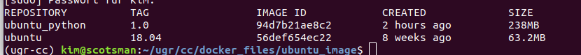

# Docker Image Base
Los criterios por cual el imagen base debe ser seleccionado son: estabilidad, actualizaciones de seguridad, dependencias actualizadas, python actualizado (v3.8), el tamaño del imagen. \

Estabilidad: Quiere una construcción en el presente para darle el mismo conjunto básico de bibliotecas, estructura de directorios e infraestructura que una construcción en el futuro.
--> de lo contrario la aplicación podría romper al azar.\

Actualizaciones de seguridad: Quiere que la imagen base esté bien mantenida, de modo que obtenga actualizaciones de seguridad para el sistema operativo.\

Dependencias actualizadas: Como las pruebas depende de las bibliotecas, quiere que ellos no están demasiado viejas.

Python actualizado: Como la aplicación será escrito en python (v 3.8) quiere tener también lo mejor la misma version de Python

Tamaño del imagen: Cuanto más pequeña sea la imagen, mejor.

## La comparación

Para compara he elegido los imagenes: Ubuntu 18.04 LTS (como es la misma sistema operativa), Python 3.8-slim y Python 3.8-buster.\

Python Slim vs Python Buster: \

Como Python Buster es mucho más grande que Python Slim. Esto se debe a que Python Buster contiene muchas paquetes comunes instalados. Por las pruebas de la applicación no es necesario tener todos las paquetes. Por eso aquí Python Slim es la mejor opción.\

Python Slim vs Ubuntu 18.04 LTS\
El imagen base de Ubuntu 18.04 es muy pequeño.

Pero ya Python no está installado.
Pues, vamos a crear un imagen de Ubuntu con Python3.8 y pip installado con un Dockerfile:\

Una vez creado podemos comparar el nuevo tamaño.

Ubuntu 18.04 contiene muchas paquetes adicionales que no necesitamos en este caso. 
