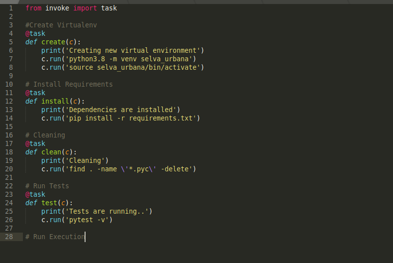

# Configuración correcta del gestor de tareas y justificación de la misma

El gestor de tareas elegido es [invoke](http://www.pyinvoke.org/).

Hay muchas opciones posibles para un gestor de tareas. Mi elección final fue **invoke** porque sigue la sintaxis común de Python y por lo tanto está más sencillo escribir y debug para mí, ya que todo este proyecto también está escrito en Python. Además, es fácil de instalar y comenzar:\
	<code>$pip install invoke<code>

## Task Automation

Invoke proporciona una API limpia y de alto nivel para ejecutar comandos desde línea de órdenes y definir/organizar la función de la tarea desde un simple fichero *tasks.py*:
En este fichero sólo necesitamos importar el módulo de task de invoke\
	<code>$from invoke import task<code>

y entonces se puede empezar a definir nuestras tareas que necesitan ser automatizadas.
Cada tarea necesita tener el decorador @task. 
En este paso del proyecto definimos las siguientes tareas.\
install: installar los dependencias del proyecto\
clean: Limpieza de los \__pycache__\
test: ejecutar de las pruebas \

Para ejecutar uno de los tareas sólo se necesita ejecutar:\
	<code>$invoke \<tarea> 

El fichero tasks.py se encuentre [aquí](../tasks.py)

