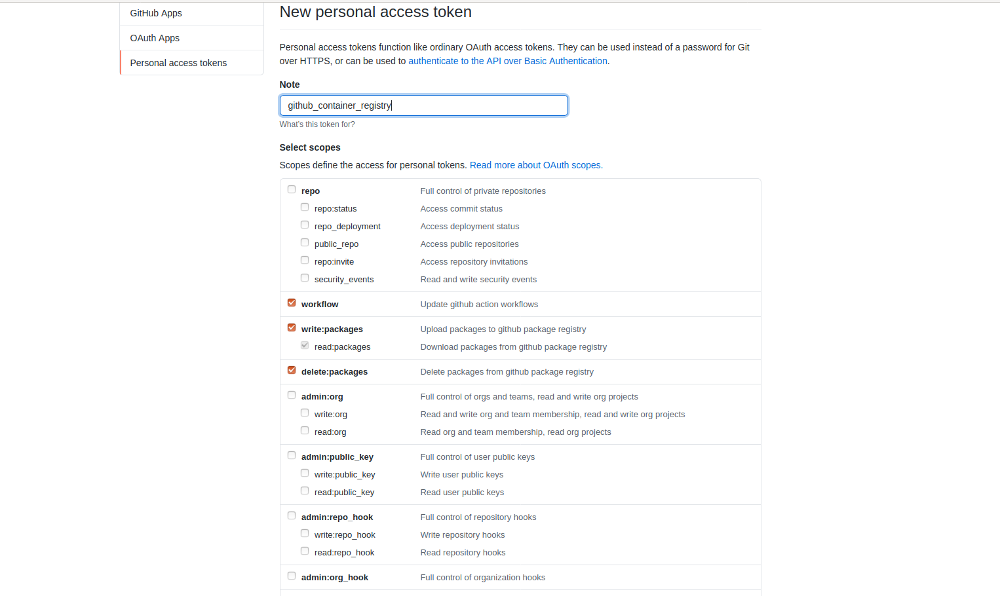
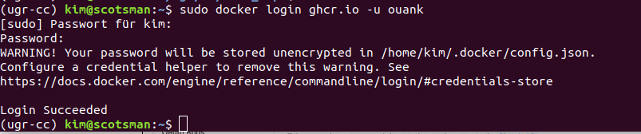
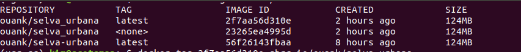
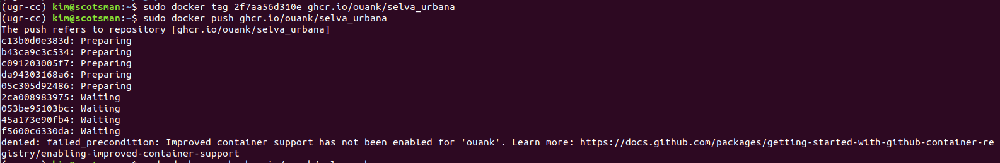
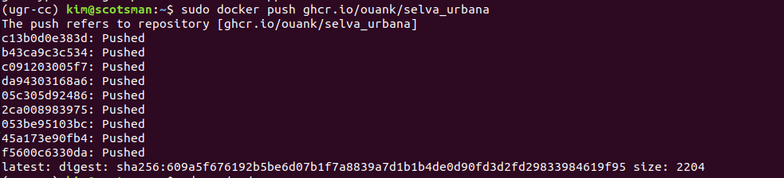
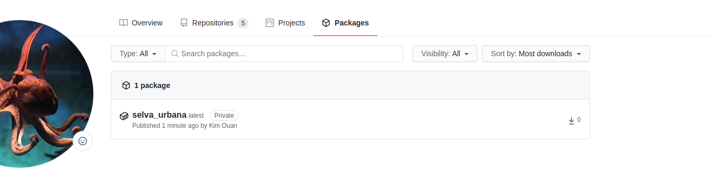
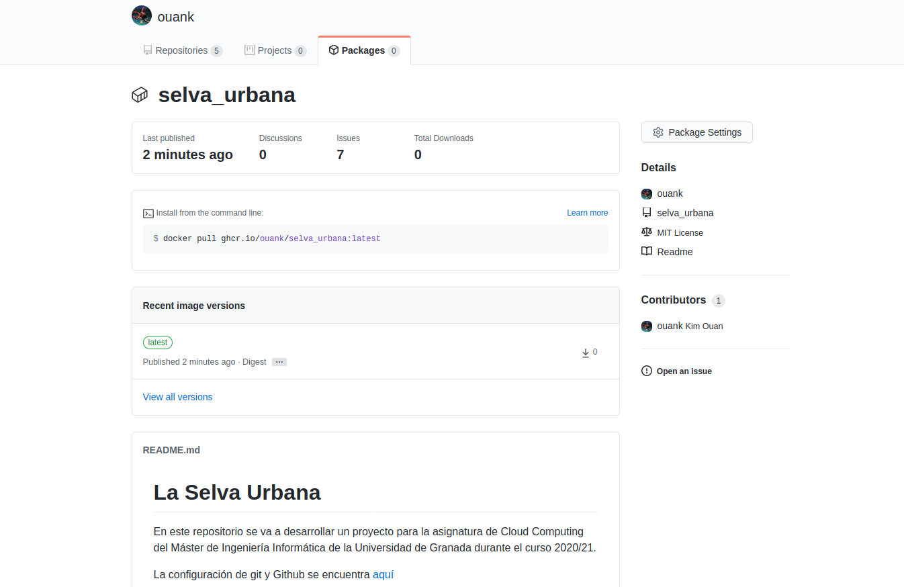

# Github Container Repository

Al inicio se necesita crear un PAT:\

Entonces se puede acceder ghcr.io de la línea de comandos:\

Pues, necesitamos push el imagen: \

Se dice que antes de push se necesita activar improved container support:\

Push otra vez:\

Ahora se puede ver el imagen en github:\
\

