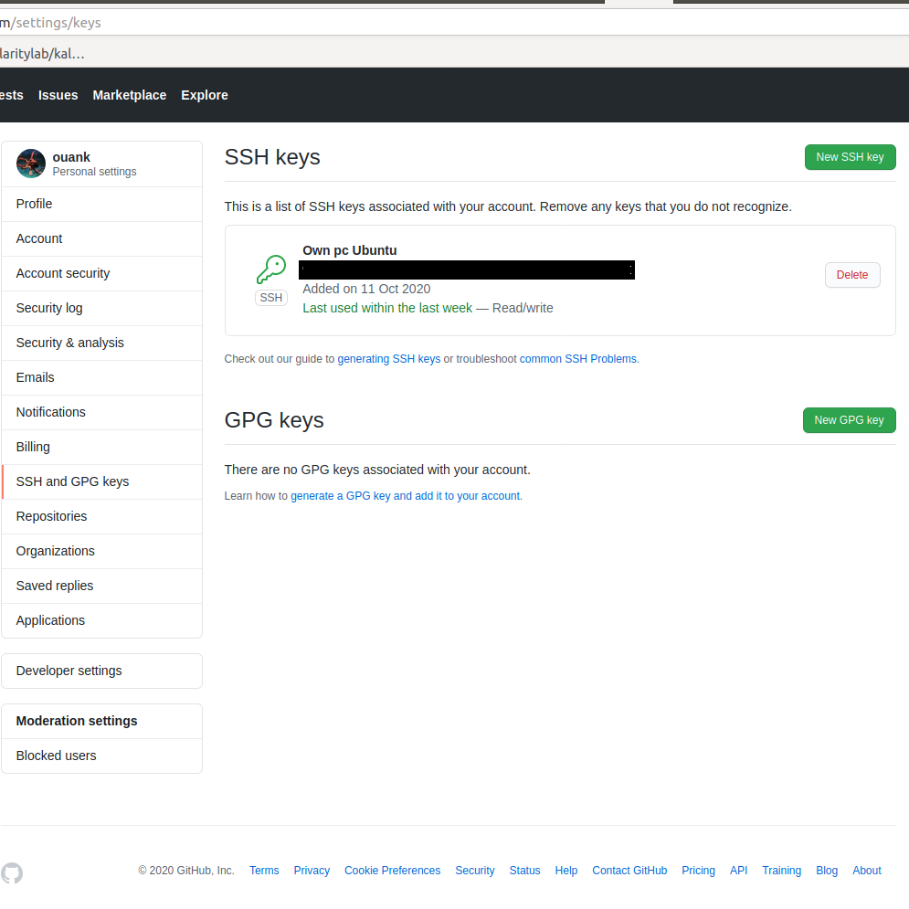
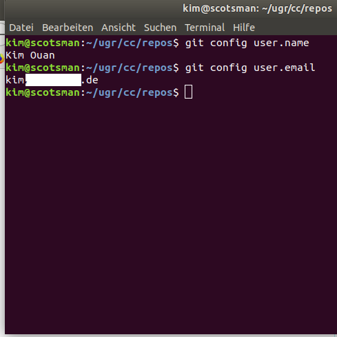
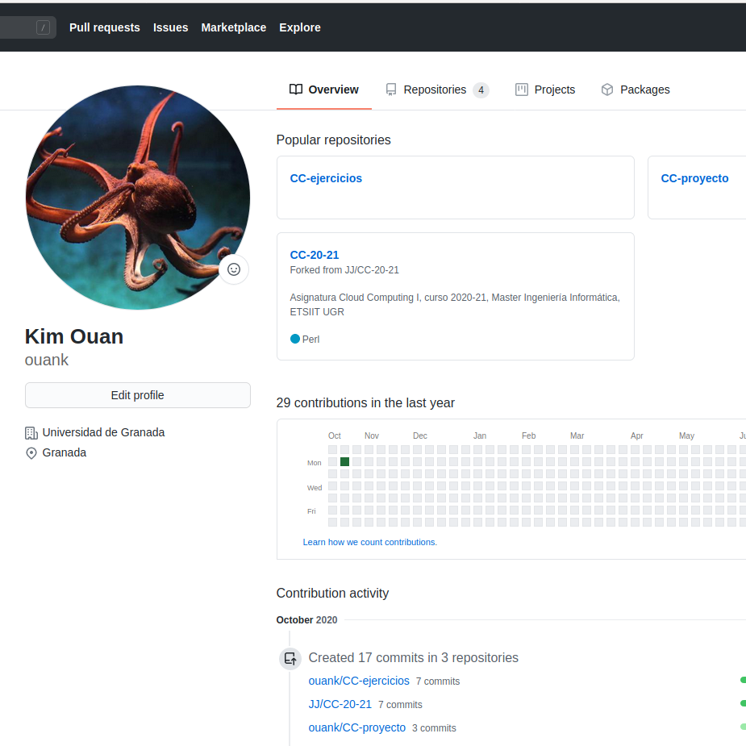
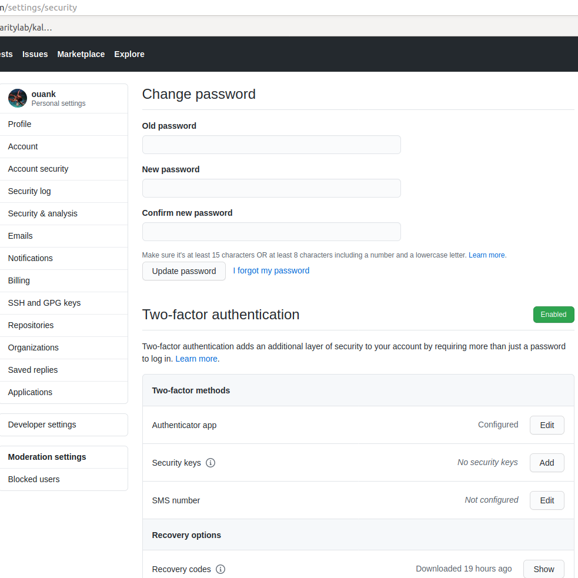

# Project Setup Documentation
Documentation of the preparation of git and Github for the Cloud Computing class at UGR.

## Creación de par de claves y subida de clave pública a GitHub.
Created private and public SSH keys and uploaded public key to the Github repository. 

## Configuración correcta del nombre y correo electrónico para que aparezca en los commits.
Changed git config --global user.name and user.email

## Edición del perfil de GitHub para que aparezca una imagen en vez del avatar por omisión, nombre completo y ciudad, así como universidad.
Added Name, Image, City and University to profile

## Incrementar la seguridad de nuestra cuenta en GitHub activando el segundo factor de autenticación.
Added Two Factor Authentication to Github Profil

